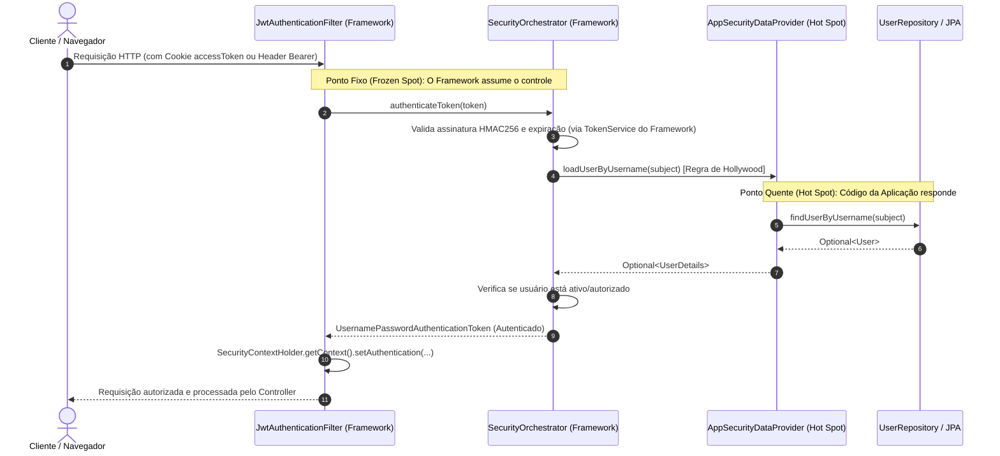

# Relatório de Refatoração: Integração do Módulo de Segurança (`gogather-framework-security`)

Este documento detalha a refatoração arquitetural realizada na aplicação `app-gogather-original` para que ela passasse a integrar, consumir e utilizar o módulo de segurança recém-refatorado do framework: `gogather-framework-security`.

---

## 1. Sumário Executivo

Anteriormente, a aplicação `app-gogather-original` executava toda a mecânica de verificação criptográfica de tokens JWT, extração de cabeçalhos HTTP/Cookies e montagem do contexto de autenticação de forma **local, manual e acoplada** em suas próprias classes (`SecurityFilter`, `TokenService` e `JWTUserData`).

Com a padronização do ecossistema GoGather, essa mecânica invariante foi encapsulada no módulo `gogather-framework-security`. A refatoração teve como objetivo substituir a interceptação HTTP procedural e a assinatura criptográfica manual da aplicação pelo motor centralizado do framework, aplicando a **Regra de Hollywood ("Don't call us, we'll call you")**. 

A aplicação conservou integralmente suas regras de negócio específicas de transporte web e sessão de longo prazo (emissão e gestão dos cookies `accessToken` e `refreshToken`, bem como persistência de tokens de refresh em banco de dados PostgreSQL), enquanto o framework assumiu o papel de **Ponto Congelado (*Frozen Spot*)** responsável pela segurança e verificação de tokens.

---

## 2. Antes vs. Depois (Evolução Arquitetural)

### 2.1. Arquitetura Anterior (Duplicação e Acoplamento Local)
- O filtro local `SecurityFilter` interceptava as requisições HTTP, extraía o cookie/header, chamava `tokenService.validateToken(token)` e consultava o banco de dados diretamente para instanciar o contexto do Spring Security.
- A classe local `TokenService` possuía acoplamento com a biblioteca `com.auth0.jwt`, lendo propriedades secretas (`spring.api.security.token.secret`), gerando assinaturas HMAC256 e verificando claims manualmente.
- Existência de classes auxiliares redundantes como `JWTUserData` para transportar dados de token internamente.

### 2.2. Arquitetura Atual (Frozen Spot do Framework + Hot Spot da Aplicação)
- **O Framework como Frozen Spot:** O encadeamento de segurança HTTP agora é protegido pelo bean `JwtAuthenticationFilter`, provido automaticamente pelo framework. Ele intercepta tokens (Cookie ou Header Bearer) e delega a verificação criptográfica ao `SecurityOrchestrator`.
- **O Gancho da Aplicação (Hot Spot):** A aplicação implementa a interface `SecurityDataProvider` do framework na nova classe `AppSecurityDataProvider`. Quando o orquestrador do framework valida um token, ele invoca esse gancho apenas para solicitar o objeto `UserDetails` correspondente no `UserRepository`.
- **Separação Limpa de Responsabilidades no `TokenService`:** A classe local foi refatorada e renomeada para o bean `appTokenService`. Toda a criação e validação de JWT foi delegada ao `SecurityOrchestrator` do framework. A classe local passou a ser responsável unicamente pelas políticas de entrega via Cookie (`httpOnly`, `secure`, `sameSite`, `maxAge`) e persistência de `RefreshToken`.



---

## 3. Detalhamento Técnico das Alterações

### 3.1. Configuração e Dependências (`pom.xml` e `application.yaml`)
1. **Adição do Módulo no POM:** Inserida a dependência de `gogather-framework-security` no arquivo `pom.xml` do backend. Corrigida também uma tag `<dependency>` de fechamento ausente na declaração do módulo de billing.
2. **Propriedades Padronizadas:** No arquivo `application.yaml`, adicionamos a configuração sob o prefixo padronizado do framework:
   ```yaml
   framework:
     security:
       jwt:
         secret: ${token.secret:my-default-secret-key-for-jwt-tokens-that-needs-to-be-long-enough-256-bits}
         expiration-minutes: 20
   ```

### 3.2. Implementação do Gancho *Hot Spot*: `AppSecurityDataProvider`
Criada a classe `AppSecurityDataProvider` no pacote `com.role.net.gogather.service.provider`, conectando o contrato do framework ao repositório JPA da aplicação:
```java
@Service
public class AppSecurityDataProvider implements SecurityDataProvider {

    private final UserRepository userRepository;

    public AppSecurityDataProvider(UserRepository userRepository) {
        this.userRepository = userRepository;
    }

    @Override
    @Transactional(readOnly = true)
    public Optional<UserDetails> loadUserByUsername(String username) {
        return userRepository.findUserByUsername(username)
                .map(user -> (UserDetails) user);
    }
}
```

### 3.3. Refatoração da Cadeia de Segurança (`SecurityConfig`)
Na classe de configuração web da aplicação (`SecurityConfig`), removemos a injeção do antigo filtro manual e injetamos diretamente o bean `JwtAuthenticationFilter` provido pela auto-configuração do framework:
```java
@Bean
public SecurityFilterChain securityFilterChain(HttpSecurity http, JwtAuthenticationFilter jwtAuthenticationFilter) throws Exception {
    return http
        .csrf(csrf -> csrf.disable())
        .cors(cors -> cors.configure(http))
        .sessionManagement(session -> session.sessionCreationPolicy(SessionCreationPolicy.STATELESS))
        .authorizeHttpRequests(auth -> auth
            .dispatcherTypeMatchers(DispatcherType.ERROR).permitAll()
            .requestMatchers("/uploads/**", "/ws-chat/**").permitAll()
            .requestMatchers(HttpMethod.POST, "/auth/login", "/auth/register", "/auth/refresh").permitAll()
            .anyRequest().authenticated())
        .addFilterBefore(jwtAuthenticationFilter, UsernamePasswordAuthenticationFilter.class)
        .build();
}
```

### 3.4. Refatoração e Delegação no `TokenService` Local
O serviço local `TokenService` (renomeado como bean `@Service("appTokenService")` para evitar colisão de nomes com o bean do framework) teve toda a sua lógica algorítmica substituída por chamadas ao `SecurityOrchestrator`:
```java
@Service("appTokenService")
public class TokenService {
    private final RefreshTokenRepository refreshTokenRepository;
    private final SecurityOrchestrator securityOrchestrator;

    public TokenService(RefreshTokenRepository refreshTokenRepository, SecurityOrchestrator securityOrchestrator) {
        this.refreshTokenRepository = refreshTokenRepository;
        this.securityOrchestrator = securityOrchestrator;
    }

    public String generateAccessToken(User user) {
        // Delega a geração e assinatura criptográfica ao Frozen Spot do Framework
        return securityOrchestrator.generateAccessToken(user.getUsername());
    }
    // ... métodos de geração de cookies e refresh token em banco mantidos intactos
}
```
Com isso, foram eliminadas as importações de `com.auth0.jwt.*`, o campo `@Value` de segredo local e o método redundante `validateToken(...)`.

### 3.5. Limpeza de Código Obsoleto
Com o framework assumindo a verificação, dois artefatos locais tornaram-se 100% redundantes e foram deletados do projeto:
* `com.role.net.gogather.config.SecurityFilter.java` (substituído pelo `JwtAuthenticationFilter` do framework);
* `com.role.net.gogather.config.JWTUserData.java` (DTO intermediário obsoleto, cuja importação também foi limpa do `GroupController.java`).

---

## 4. Resumo das Alterações (Mapeamento de Arquivos)

| Arquivo / Componente | Ação | Descrição |
| :--- | :--- | :--- |
| `pom.xml` (backend) | **MODIFICADO** | Adicionada a dependência do módulo `gogather-framework-security` e corrigida a formatação de tags XML no módulo billing. |
| `application.yaml` | **MODIFICADO** | Inseridas as propriedades `framework.security.jwt.secret` e `expiration-minutes` para configurar o motor do framework. |
| `AppSecurityDataProvider.java` | **CRIADO** | Implementação do gancho *Hot Spot* (`SecurityDataProvider`), conectando o framework ao `UserRepository`. |
| `SecurityConfig.java` | **MODIFICADO** | Substituído o filtro de segurança local pelo `JwtAuthenticationFilter` provido pela auto-configuração do framework. |
| `TokenService.java` (app) | **MODIFICADO** | Renomeado para bean `appTokenService`. Delegada a geração e validação de JWT para o `SecurityOrchestrator`, removendo o código criptográfico manual. |
| `GroupController.java` | **MODIFICADO** | Removida importação não utilizada do DTO `JWTUserData`. |
| `SecurityFilter.java` | **REMOVIDO** | Filtro local excluído em favor do filtro padronizado do framework. |
| `JWTUserData.java` | **REMOVIDO** | DTO obsoleto excluído após a centralização da verificação de tokens. |

---

## 5. Validação e Resultados de Build/Testes

Para certificar que a integração do novo módulo de segurança não quebrou os contratos de autenticação, sessões, cookies ou endpoints da aplicação, executamos a compilação completa e a suíte de testes de integração e contexto via Maven (`mvn test`).

* **Suíte de Testes Executada:**
  * `GoGatherApplicationTests` (validação de carga de contexto Spring com a nova auto-configuração de segurança).
  * `ExpenseServiceBillingIntegrationTest` (validação de integração transacional de serviços autenticados no ecossistema).
* **Resultado do Log de Execução:**
  ```
  [INFO] Tests run: 1, Failures: 0, Errors: 0, Skipped: 0 -- in com.role.net.gogather.GoGatherApplicationTests
  [INFO] Tests run: 2, Failures: 0, Errors: 0, Skipped: 0 -- in com.role.net.gogather.service.ExpenseServiceBillingIntegrationTest
  [INFO] Results:
  [INFO] Tests run: 3, Failures: 0, Errors: 0, Skipped: 0
  [INFO] BUILD SUCCESS
  ```
A refatoração preservou 100% do funcionamento dos endpoints de login, registro, cookies HTTP-only e web-sockets, comprovando a eficácia do isolamento entre o motor de segurança do framework (*Frozen Spot*) e as regras de negócio web da aplicação (*Hot Spot*).
