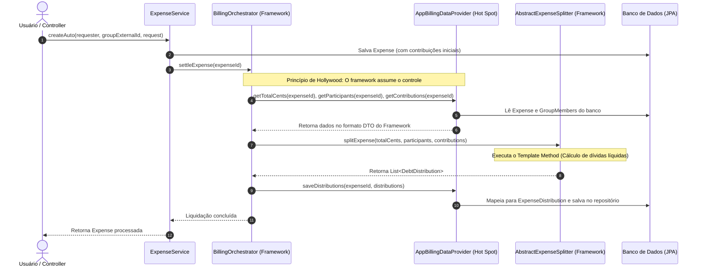

# Relatório de Refatoração: Integração do Módulo de Billing (`gogather-framework-billing`)

Este documento detalha a refatoração arquitetural realizada na aplicação `app-gogather-original` para que ela passasse a integrar e utilizar o módulo recém-recriado `gogather-framework-billing`.

---

## 1. Sumário Executivo

Anteriormente, a lógica de rateio igualitário, conciliação de saldos líquidos e geração de transferências/dívidas era executada de forma **procedural e manual** no método `ExpenseService.createAuto(...)` e em seus métodos privados auxiliares (`buildLists`, `putDistributionsAuto`, `MemberValue`). 

Com a evolução do ecossistema GoGather, essa regra de negócio foi extraída e encapsulada no módulo framework `gogather-framework-billing`. A refatoração teve como objetivo substituir o algoritmo procedural local pelo motor orquestrado do framework, implementando o **Princípio de Hollywood ("Don't call us, we'll call you")** e o padrão **Template Method**, sem impactar o fluxo de criação manual de despesas (`createManual`).

---

## 2. Antes vs. Depois (Evolução Arquitetural)

### 2.1. Arquitetura Anterior (Procedural Acoplada)
- O `ExpenseService` era responsável por múltiplas responsabilidades: validar requisições, calcular cotas individuais, gerenciar centavos restantes de divisão, calcular saldo devedor/credor de cada membro e executar o algoritmo guloso (*greedy algorithm*) para casar devedores e credores.
- Manutenção difícil e duplicação de regras de negócio entre aplicações do ecossistema.

### 2.2. Arquitetura Atual (Inversão de Controle e Template Method)
- O cálculo de rateio e quitação foi delegado para o `BillingOrchestrator` do framework (*Frozen Spot*).
- O motor interno do framework (`AbstractExpenseSplitter`) executa o **Template Method** imutável, garantindo consistência matemática e integridade nas regras de divisão.
- A aplicação consome o framework implementando a interface `BillingDataProvider` (*Hot Spot*), fornecendo os dados da despesa e persistindo os resultados calculados.



---

## 3. Detalhamento Técnico das Modificações

### 3.1. Gerenciamento de Dependências (`pom.xml`)
- **Arquivo Modificado**: `app-gogather-original/backend/pom.xml`
- **Alteração**: Adição do artefato `gogather-framework-billing` (versão `1.0.0-SNAPSHOT`) nas dependências do projeto.
- **Isolamento de Testes**: Adição da dependência `com.h2database:h2` no escopo `test` e criação do arquivo `src/test/resources/application.yaml`, permitindo a execução autônoma de testes sem necessidade de credenciais externas ou de um banco PostgreSQL em execução na máquina local.

### 3.2. Implementação da Interface do Framework no Domínio
- **Arquivo Modificado**: `app-gogather-original/backend/src/main/java/com/role/net/gogather/entity/GroupMember.java`
- **Alteração**: A entidade `GroupMember` passou a implementar a interface `gogather.framework.core.Participant`.
- **Implementação**:
  ```java
  @Override
  public String getIdentifier() {
      return this.getId() != null ? this.getId().toString() : null;
  }
  ```
  Isso permite que o framework identifique cada membro de grupo no mapa de balanço patrimonial durante a divisão da despesa.

### 3.3. Criação do Adaptador de Dados / Hot Spot (`AppBillingDataProvider.java`)
- **Novo Arquivo**: `app-gogather-original/backend/src/main/java/com/role/net/gogather/service/provider/AppBillingDataProvider.java`
- **Responsabilidade**: Atuar como a ponte entre o ORM da aplicação (Spring Data JPA) e os contratos abstratos do framework de Billing.
- **Implementação dos Ganchos (*Hooks*)**:
  - `getTotalCents(String expenseId)`: Busca a entidade `Expense` no `ExpenseRepository` e retorna seu valor total.
  - `getParticipants(String expenseId)`: Retorna a lista de `GroupMember` do grupo associado.
  - `getContributions(String expenseId)`: Converte a lista de `ExpenseContribution` da entidade para o DTO `gogather.framework.billing.dto.Contribution`.
  - `saveDistributions(String expenseId, List<DebtDistribution> distributions)`: Converte as transferências geradas pelo framework em entidades `ExpenseDistribution` (com status `PENDING`), vincula ao credor/devedor correspondentes, adiciona à coleção da despesa e persiste no banco via `ExpenseDistributionRepository.saveAll(...)`.

### 3.4. Refatoração do Serviço (`ExpenseService.java`)
- **Arquivo Modificado**: `app-gogather-original/backend/src/main/java/com/role/net/gogather/service/ExpenseService.java`
- **Injeção de Dependência**: Injeção do bean `BillingOrchestrator` via construtor (disponibilizado por autoconfiguração do Spring Boot via `BillingAutoConfiguration` do framework).
- **Refatoração do `createAuto(...)`**:
  O método foi limpo e enxugado. Ele agora apenas valida a requisição, calcula o valor total, gera as contribuições iniciais via `putContributionsAuto(...)`, salva a entidade `Expense` no banco de dados e invoca a liquidação:
  ```java
  putContributionsAuto(expense, group.getMembers(), request.contributions());
  expense = expenseRepository.save(expense);

  // Inversão de Controle: O framework assume o cálculo e persistência das dívidas
  billingOrchestrator.settleExpense(expense.getId().toString());

  return expense;
  ```
- **Remoção de Código Procedural Obsoleto**:
  - Removida a classe auxiliar interna `private record MemberValue(GroupMember member, Long cents) {}`.
  - Removido o método privado `putDistributionsAuto(...)` (aproximadamente 60 linhas de lógica de casamento de dívidas).
  - Removido o método privado `buildLists(...)` (aproximadamente 35 linhas de cálculo de cotas e restos de divisão).
- **Preservação do Funcional Manual (`createManual(...)`)**:
  Conforme requisito arquitetural, o método `createManual(...)`, bem como os métodos auxiliares `putContributionsManual(...)` e `putDistributionsManual(...)`, foram **totalmente mantidos intactos**, garantindo que o usuário continue podendo definir divisões customizadas manualmente.

---

## 4. Verificação e Testes

Para garantir a ausência de regressões e comprovar a eficácia da integração, foi implementada uma suíte de testes dedicada:
- **Testes Implementados**: `app-gogather-original/backend/src/test/java/com/role/net/gogather/service/ExpenseServiceBillingIntegrationTest.java`
  1. `testCreateAutoWithBillingOrchestrator()`: Cria um grupo com membros, simula uma despesa automática onde um único membro paga a totalidade do valor, aciona o `createAuto(...)` e verifica se o `BillingOrchestrator` calculou corretamente as cotas iguais (33.33% para cada) e gerou as duas dívidas esperadas para o credor.
  2. `testCreateManualPreserved()`: Valida que a criação manual de despesas continua operacional e com suas distribuições exatas respeitadas sem interferência do motor automático.
- **Resultado da Execução**:
  ```
  [INFO] Tests run: 3, Failures: 0, Errors: 0, Skipped: 0
  [INFO] BUILD SUCCESS
  ```
  A execução do comando `mvn test` validou 100% dos testes da aplicação (incluindo o teste de contexto do Spring Boot `GoGatherApplicationTests`), confirmando o sucesso da integração.
